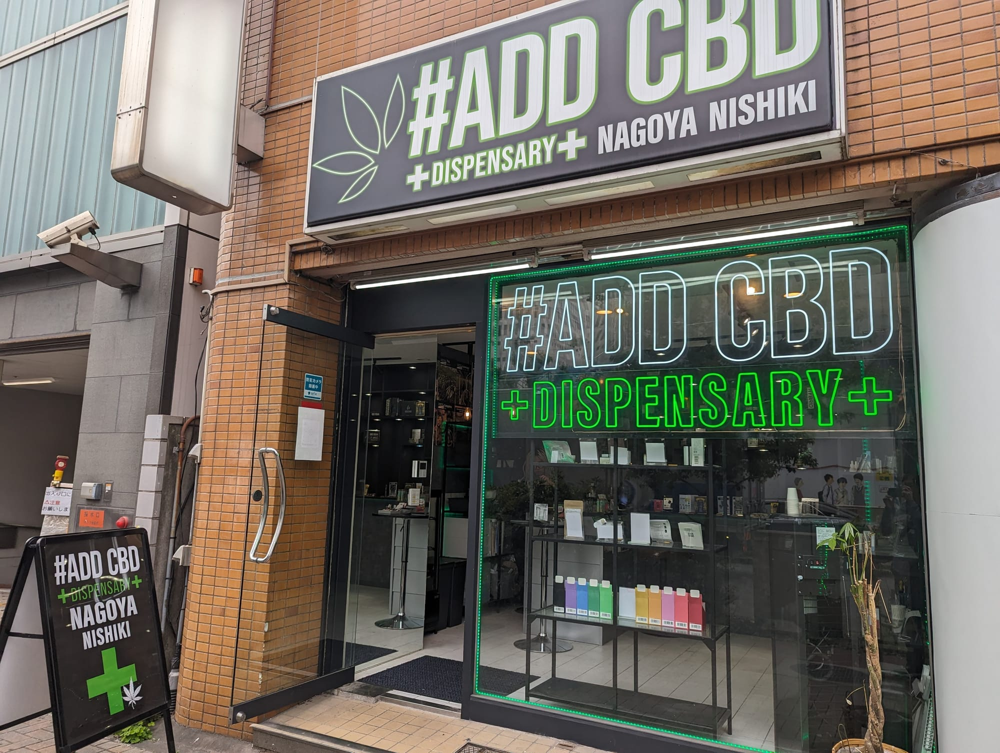
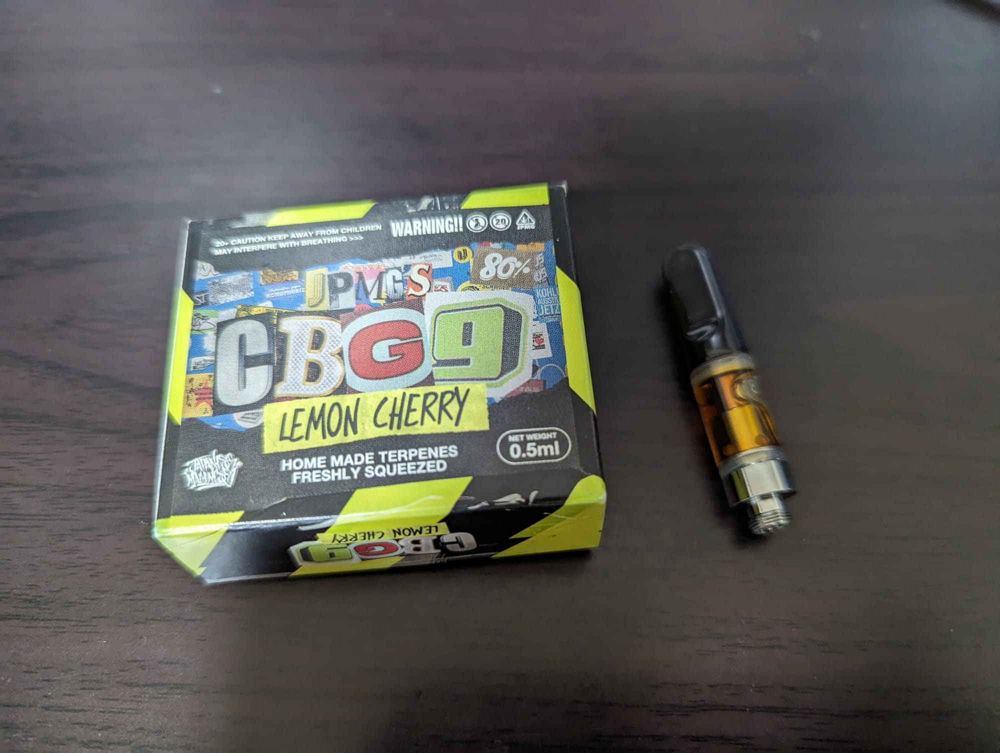

先日、名古屋栄にあるADD CBDの店舗に行ってきました。

様々な商品がありましたが、その中でもADD CBDのXアカウントが推していたCBG9を買ってみました。

ジャパニーズマゲニーズという有名なラッパーグループとのコラボ製品らしいです。

## レビュー

### ナチュラルな体感、サイコアクティブ的な体感は無し

最近はHHCPOのようなサイコアクティブ系カンナビノイドが流行っていますが、それによく見られるマンチーや気分の変容(いわゆる"ハイ"になるなど)はありません。

そのため、サイコアクティブ系が好きな方には合わないかもしれません。

しかし、サイコアクティブ系は使い続けると効果が薄くなってしまうので、そういった際に使うのはアリだと思います。

### 抑うつ症状が落ち着く

私は双極性障害を患っていて、特に抑うつ症状が強く出ています。

処方薬はしっかり飲んでいますが、それでも症状が完全には消えず日常生活に支障をきたしています。

そんな状態でCBG9を吸ってみたところ、気にならないレベルまで症状が落ち着きました。

同じように抑うつ症状に悩む方は試す価値があるかもしれません。

#### 注意

カンナビノイドの効果は個人差があります。

私の友人にもカンナビノイドが全く効かない人がいます。

そのため、最初は0.5mLの製品を1つだけ買うことをおすすめします。

本製品は執筆時点で0.5mLのみが販売されているため、買い間違うことは無いと思います。

### 味は普通に大麻

味は普通に大麻なので、土っぽい味が苦手な方はご注意ください。

私はGG#4のような味が好みなのですが、毎日吸えるくらいには好きな味です。

## 総評

体感・味ともに満足できる製品でした。

HHCPOのような強い体感ではないので、カンナビノイド初心者にもおすすめです。

気になった方は是非最寄りの店舗またはオンラインストアにてご購入ください。

【PR】CBG9 80% 0.5mL
