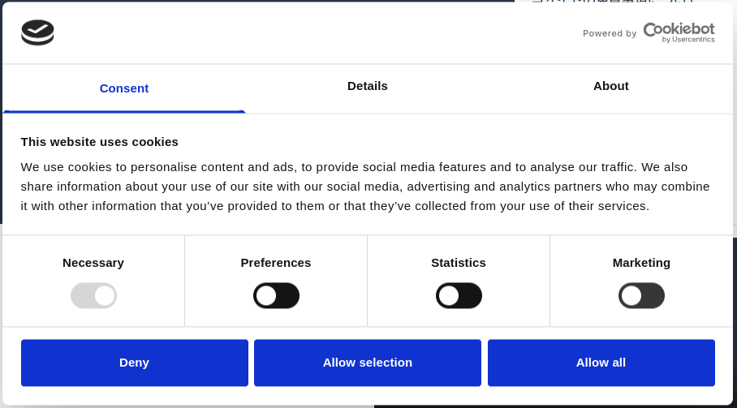
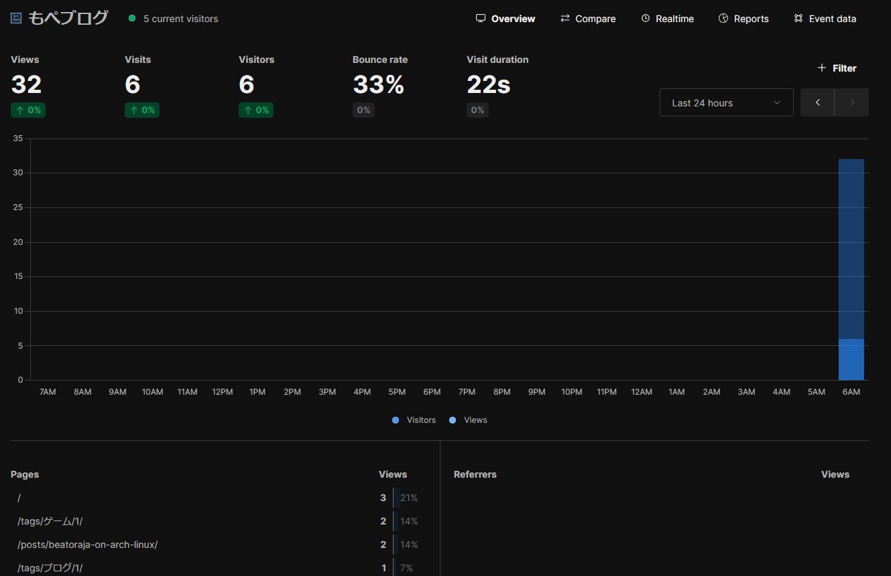

みなさんは閲覧者のプライバシー保護について意識していますか？

[GoogleがサードパーティCookieの廃止を撤回](https://privacysandbox.com/news/privacy-sandbox-update/)した中で[Appleがプライバシーに関する新しいキャンペーンを開始](https://www.apple.com/jp/privacy/)するなど、現在インターネットにおけるプライバシーは重要になっています。

サイトを運営されている方だと、Googleアドセンスのターゲッティング広告を掲載し、Googleアナリティクスでアクセス解析をしていることが多いと思います。

たしかにそれらは便利ですが、サードパーティCookieやユーザー判別を行っているため、ユーザーのプライバシーに懸念が生じます。

また、プライバシーポリシーにオプトアウトの方法を記載していたとしても、そもそもプライバシーポリシーを読む方が少ないのではないでしょうか。

そこで、本記事ではユーザーがオプトイン・オプトアウトを選択しやすくしたり、同じ機能でもプライバシーを重視するようなサービスを紹介します。

## Cookiebot: ユーザーの識別を簡単に許可・拒否

[Cookiebot](https://www.cookiebot.com/)はCMP(Consent Management Platform、同意管理プラットフォーム)の一つです。

CMPを用いることで、ユーザーから個人情報や[個人関連情報](https://www.ppc.go.jp/all_faq_index/faq2-q2-8/)の利用に対する許諾を得ることができます。

実際に導入した画面がこちらです。

Cookiebotでは、利用されるカテゴリや会社名、具体的にどのように利用されるかを自動的に掲載してくれます。

そのため、サービスを導入して簡単な設定を行うだけで、ユーザーが個人情報や個人関連情報を制御できるようになります。

## Umami: シンプルなアクセス解析ツール

[Umami](https://umami.is/)はオープンソースのアクセス解析ツールです。

従来のGoogleアナリティクス(ユニバーサルアナリティクス)に近い機能性のため使いやすいです。

また、UmamiではCookieを使用しておらず、すべての訪問者データは匿名化されています。

そのため、ユーザーのプライバシーを保護しながらアクセス解析を行うことができます。

導入方法はセルフホスティング(自分でサーバを用意して運用すること)とクラウド型の2種類から選べます。

クラウド型は一定のイベント数を超えると有料になりますが、自身でサーバを保守するコストを考えると安いように思えます。

ちなみに、クラウド型のデータ保存先はアメリカ合衆国とヨーロッパから選択できるため、プライバシー意識が高い方でも安心して利用できます。

## EthicalAds: トラッキングを用いないアドネットワーク

[EthicalAds](https://www.ethicalads.io/)はトラッキングを用いないアドネットワークです。

掲載したページのコンテンツから適切な広告を選んでくれるようです。

また、たった2つのHTML要素を追加するだけで広告を掲載できるため、サイト編集の手間が省けます。

さらに、1ページに一つの広告しか掲載されないため、ユーザーにとってもUXが向上します。

実際に導入してみたかったのですが、50,000PV/月が最低条件であったため出来ませんでした…。

## まとめ

知らないサービスはありましたか？

以上の3つのサービスを活用することで、ユーザーのプライバシーを保護しながらサイトを運営できます。

他にもプライバシー保護に役立つツールが[Privacy Guides](https://www.privacyguides.org/en/)にて紹介されているので、こちらもご参照ください。
