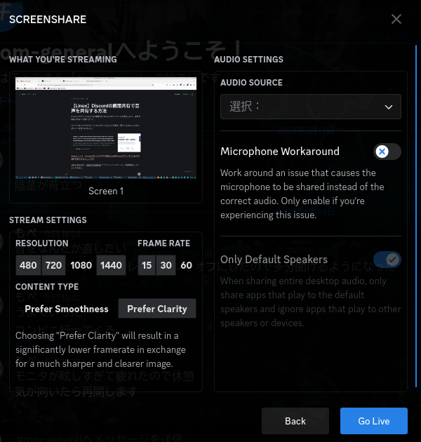

Windowsでやっていたように画面共有でFirefoxのウインドウを共有したら、音声が共有されなくて困りました。

ハードウェアアクセラレーションをオフにしても同様で、調べてみるとこんなリポジトリを見つけました。

[edisionnano/Screenshare-with-audio-on-Discord-with-Linux](https://github.com/edisionnano/Screenshare-with-audio-on-Discord-with-Linux)

Vesktopという、Vencordが作ったブラウザ版DiscordをElectronでラップしたもので音声共有できるらしいです。

AURにあるので、`paru -S vesktop` でサクッとインストールして画面共有しようとしてみると...

オーディオソースが選べる、これで音声を共有できますね。

それよりも**Nitroじゃないのに1440p 60fpsが選べる**のが気になります。

やってみたら出来ちゃいましたが、Discord運営に気づかれたら間違いなくBANされるので使わないようにします。

思いもよらない副産物が得られましたが、とにかくうまくいったので記事にしておきます。
